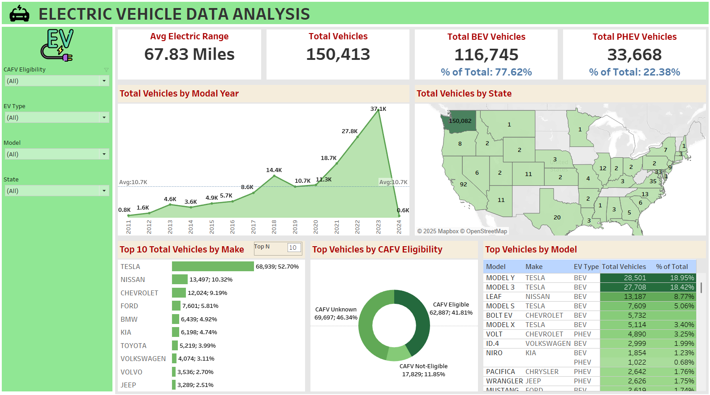

# 🚗 Electric Vehicle Data Analysis

This project analyzes electric vehicle adoption trends and market characteristics using **Tableau**. The dashboard provides comprehensive insights into the electric vehicle landscape, including distribution by type, manufacturer, model, geographical spread, and market growth over time.

---

## 📌 Problem Statement

This analysis aims to understand the current trends in electric vehicle (EV) adoption and how different factors such as range, model, type, and geography impact the EV market.

---

## 📊 KPI Requirements

1. **Total Vehicles**  
   Understand the overall landscape of electric vehicles, encompassing both BEVs and PHEVs, to assess the market's size and growth.

2. **Average Electric Range**  
   Determine the average electric range of the electric vehicles in the dataset to gauge the technological advancements and efficiency of EVs.

3. **Total BEV Vehicles and % of Total BEV Vehicles**  
   Identify and analyze the total number of Battery Electric Vehicles (BEVs).  
   Calculate the percentage of BEVs relative to the total number of electric vehicles.

4. **Total PHEV Vehicles and % of Total PHEV Vehicles**  
   Identify and analyze the total number of Plug-in Hybrid Electric Vehicles (PHEVs).  
   Calculate the percentage of PHEVs relative to the total number of electric vehicles.

---

## 📈 Charts Requirements

1. **Total Vehicles by Model Year (From 2010 Onwards)**  
   - **Visualization:** Line/Area Chart  
   - **Description:** Illustrates the distribution of electric vehicles over the years, showing growth patterns and adoption trends.

2. **Total Vehicles by State**  
   - **Visualization:** Map Chart  
   - **Description:** Showcases the geographical distribution of electric vehicles across states, identifying regions with higher adoption.

3. **Top 10 Total Vehicles by Make**  
   - **Visualization:** Bar Chart  
   - **Description:** Highlights the top 10 electric vehicle manufacturers by total vehicles, showing brand dominance.

4. **Total Vehicles by CAFV Eligibility**  
   - **Visualization:** Pie or Donut Chart  
   - **Description:** Shows the proportion of EVs eligible for Clean Alternative Fuel Vehicle incentives.

5. **Top 10 Total Vehicles by Model**  
   - **Visualization:** Tree Map  
   - **Description:** Displays the top 10 EV models by total vehicle count, providing insights into popular models.

---

## 📌 Key Findings

- **Total EVs in the dataset:** 150,413  
- **BEVs:** 116,745 (77.62%)  
- **PHEVs:** 33,668 (22.38%)  
- **Average Electric Range:** 67.83 miles  
- **Top Manufacturer:** Tesla (68,939 vehicles | 52.70% share)  
- **Top Models:**  
  - Tesla Model Y: 18.95%  
  - Tesla Model 3: 18.42%  
- **Top State by EV Count:** Washington  
- **CAFV Eligible Vehicles:** 41.81%

---

## 🛠️ Tools Used

- **Tableau** – Data visualization and dashboard creation

---

## 📷 Dashboard Preview

---

## ▶️ How to Use

1. Clone this repository  
2. Open the Tableau workbook file  
3. Explore the interactive dashboard  
4. Use filters on the left panel to customize your view

---

## 🗃️ Data Source

The dataset includes details about electric vehicles such as:
- Make & model  
- Type (BEV/PHEV)  
- Electric range  
- Geographical information (state-wise)

---

## 🚀 Future Enhancements

- Add time-based analysis for seasonal trends  
- Incorporate charging infrastructure data  
- Include price analysis of EV models  
- Analyze correlation between incentives and EV adoption

---

## 🙌 Credits

This project was created as part of a learning exercise following tutorials by **[Data Tutorials]**.  
Special thanks to Data Tutorials for providing guidance and inspiration for this project.
